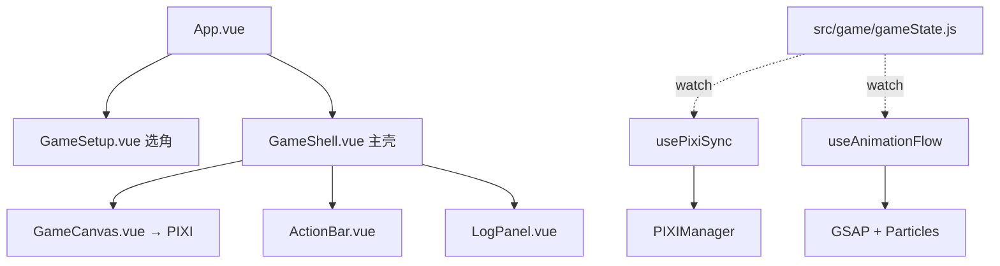

# CLAUDE.md

亡命十三街 — 基于扑克牌的多人对战游戏。Vue 3 驱动 UI，PixiJS v8 渲染牌桌，GSAP 负责动画，Tauri 打包桌面端。
本项目使用中文与用户交流。

**线上地址：** `https://drtion.github.io/dead4thirteen/`（GitHub Pages 自动部署）

## 常用命令

```bash
npm run dev          # Vite 开发服务器
npm run build        # 生产构建（vite build → postbuild 内联）
npm run preview      # 预览构建产物
npm run test         # 运行 vitest 测试
npm run tauri:dev    # Tauri 桌面开发
git push             # 推送后 GitHub Actions 自动部署 Pages
```

## 核心设计原则（最重要，每次变更必须遵守）

1. **`src/game/` 是纯逻辑层 — 零依赖。** 不引用 Vue、PIXI、GSAP 或浏览器 API。所有游戏规则在这里。
2. **单向数据流：** `gameState` (Vue reactive) → `usePixiSync` (watch) → `PIXIManager` (渲染)。不反向操作。
3. **新机制用通用标记。** 如 `endTurn` 控制回合推进（true=下一玩家，false=当前玩家额外行动），不搞角色特殊路径。
4. **PixiJS 对象用 `shallowRef`，不用 `ref()`。** Vue 深度响应式代理会破坏纹理引用。GSAP 动画用 `sprite.scale.x` 不是 `scaleX`。
5. **伤害计算：先 -2 再 2:1 联盟分配，向下取整（`Math.floor`）。**

## 架构



| 层     | 目录              | 职责                                       |
| ------ | ----------------- | ------------------------------------------ |
| 纯逻辑 | `src/game/`       | 状态机 + 角色技能 + AI + 天气（零依赖）    |
| 桥接   | `src/bridge/`     | 监听 gameState → 驱动 PIXI + GSAP          |
| 渲染   | `src/pixi/`       | PixiJS v8 Application + 精灵 + 布局 + 粒子 |
| UI     | `src/components/` | Vue 3 组件（ACtionBar、GameShell 等）      |

## 游戏状态机

```
PHASE: SETUP → PEACE(前N回合禁攻) → NORMAL(战斗) → GAME_OVER
STEP:  pickAction → attackShowCard → pickTarget → ... → pickAction（循环）
```

`STEP` 驱动 UI（ActionBar 中 `v-if` 判断 `state.step`）。

## 领域 Agents（按需自动激活）

| Agent       | 文件                            | 触发条件                           |
| ----------- | ------------------------------- | ---------------------------------- |
| game-logic  | `.claude/agents/game-logic.md`  | 修改 `src/game/`                   |
| pixi-render | `.claude/agents/pixi-render.md` | 修改 `src/pixi/` 或 GameCanvas.vue |
| animation   | `.claude/agents/animation.md`   | 修改 `src/bridge/` 或 effects/     |
| vue-ui      | `.claude/agents/vue-ui.md`      | 修改 `src/components/` 或 App.vue  |

## 构建关键点

- **`codeSplitting: false`**（vite.config.js）— PixiJS v8 动态 import 在 file:// 协议会失败，必须合并单一 bundle。
- **`resolution` 上限 2x** — `Math.min(dpr, 2)`，移动端 3x 屏 GPU 过载。
- **分发用线上 URL** — 不要依赖 file://（iOS WKWebView 彻底禁止）。
- **Canvas**: 默认 `position: fixed; z-index: 1`；竖屏滚动切为 `position: relative; touch-action: pan-y`。

## 关键文件

| 文件                             | 行数 | 说明                                  |
| -------------------------------- | ---- | ------------------------------------- |
| `src/game/gameState.js`          | 1215 | 核心：状态机 + 全部游戏操作（待拆分） |
| `src/game/constants.js`          | 156  | 角色数据 CHARACTERS、阶段/步骤/天气   |
| `src/game/deck.js`               | 60   | 扑克牌创建/洗牌/抽牌/墓地重构         |
| `src/pixi/core/PIXIManager.js`   | 268  | Application 管理 + 场景树 + 粒子      |
| `src/pixi/layout/TableLayout.js` | 203  | 自适应布局（横屏单/双行，竖屏2列）    |
| `src/bridge/useAnimationFlow.js` | 352  | GSAP 动画触发 + 粒子调度              |

## 已修复的关键 Bug（禁止重复犯错）

- `new Sprite()` 空纹理设 width/height → NaN scale 崩溃
- `CardSprite._renderEmpty()` 首次调用时 `_dashText` 为 null
- 冰封效果 `nextPlayer` 无深度保护 → 无限递归
- 花色 `SUITS` 为空字符串（必须保持 `♠♥♦♣`）
- `buildScene()` 传 TableLayout 尺寸**不能除以 resolution**
- 竖屏 canvas 用 `position: absolute` → 不占文档流无法滚动
