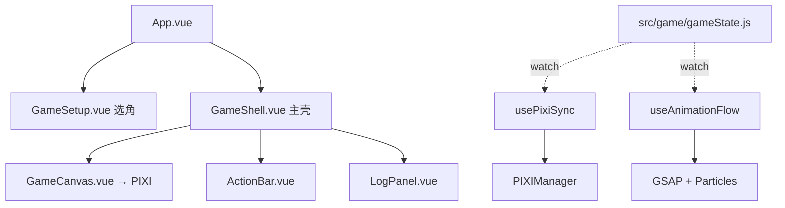

# CLAUDE.md

亡命十三街 — 基于扑克牌的多人对战游戏。Vue 3 驱动 UI，PixiJS v8 渲染牌桌，GSAP 负责动画，Tauri 打包桌面端。
本项目使用中文与用户交流。

**线上地址：** `https://menghun-myracler.github.io/13street/`（GitHub Pages 自动部署）

## 快速开始

单 session 工作流。收到任务直接改，改完跑 `npm run test`。

## 常用命令

```bash
npm run dev          # Vite 开发服务器
npm run build        # 生产构建（vite build → postbuild 内联）
npm run preview      # 预览构建产物
npm run test         # 运行 vitest 测试
npm run tauri:dev    # Tauri 桌面开发

```

## 禁用操作

PR以及gh CLI会导致用户GitHub账户封禁，禁止使用。
禁用worktree分支，修改直接作用在main里
禁止自己git push操作，更新完游戏提醒用户手动push

## 核心设计原则（最重要，每次变更必须遵守）

1. **`src/game/` 是纯逻辑层 — 零依赖。** 不引用 Vue、PIXI、GSAP 或浏览器 API。所有游戏规则在这里。
2. **单向数据流：** `gameState` (Vue reactive) → `usePixiSync` (watch) → `PIXIManager` (渲染)。不反向操作。
3. **新机制用通用标记。** 如 `endTurn` 控制回合推进（true=下一玩家，false=当前玩家额外行动），不搞角色特殊路径。
4. **PixiJS 对象用 `shallowRef`，不用 `ref()`。** Vue 深度响应式代理会破坏纹理引用。GSAP 动画用 `sprite.scale.x` 不是 `scaleX`。
5. **伤害计算：先 -2 再 2:1 联盟分配，向下取整（`Math.floor`）。**
6. **角色数据用 `getCharData(player)` 查表。** 不要直接访问 `player.characterName`/`skillName`/`skillDesc` 等——这些字段已移入 CHARACTERS 字典，player 上只保留 `characterId`（数字）。
7. **Player 嵌套字段写完整路径。** 状态效果 → `player.statusEffects.xxx`，关系 → `player.relations.xxx`。详见 `/contract`。
8. **行动顺序按 `CHARACTERS[id].speed` 每回合重排。** speed 降序（大=先动），dead 排末尾，同速按 index 升序。

## 行为准则 — 信息不足时必须追问（最重要）

**绝对禁止在信息不完整时猜测或假设。** 以下情况必须停下来追问用户，不继续执行：

1. **Bug 报告太模糊** — 用户只说「XX 有 bug」但没有给错误日志、复现步骤、预期/实际行为。追问：「请提供控制台报错或 `[game]` 日志，并描述预期行为 vs 实际行为」
2. **功能需求不明确** — 用户说「加一个新角色」但没给技能名称、效果、数值。追问：「新角色的技能是什么？效果数值？是否有使用次数限制？」
3. **多个可能原因时** — bug 有 2 个以上可能的原因时，不要赌一个去改。列出所有假设，追问用户或读日志排除后再改。
4. **第一次听说的问题** — 用户描述的问题不在已修复 Bug 列表或你的认知范围内，先追问细节，不要直接动手。

**好的提问示范：**

> 「你说的『攻击伤害不对』，具体是哪个角色攻击哪个目标？伤害值预期多少、实际多少？控制台 `[game]` 日志里 `damage_calc` 那行输出是什么？」

**善用question** — 不确定的地方不要猜测，question用户获得最准确的方向

## 架构


```mermaid
graph TD
    A[App.vue] --> B[GameSetup.vue 选角]
    A --> C[GameShell.vue 主壳]
    C --> D[GameCanvas.vue → PIXI]
    C --> E[ActionBar.vue]
    C --> F[LogPanel.vue]

    G[src/game/gameState.js] -. watch .-> H[usePixiSync]
    G -. watch .-> I[useAnimationFlow]
    H --> J[PIXIManager]
    I --> K[GSAP + Particles]
```

| 层     | 目录              | 职责                                       |
| ------ | ----------------- | ------------------------------------------ |
| 纯逻辑 | `src/game/`       | 状态机 + 角色技能 + AI + 天气（零依赖）    |
| 桥接   | `src/bridge/`     | 监听 gameState → 驱动 PIXI + GSAP          |
| 渲染   | `src/pixi/`       | PixiJS v8 Application + 精灵 + 布局 + 粒子 |
| UI     | `src/components/` | Vue 3 组件（ACtionBar、GameShell 等）      |

## 游戏状态机

```
PHASE: SETUP → PEACE(前N回合禁攻) → NORMAL(战斗) → GAME_OVER
STEP:  pickAction → attackShowCard → pickTarget → ... → pickAction（循环）
```

`STEP` 驱动 UI（ActionBar 中 `v-if` 判断 `state.step`）。

## Skills & 调试

| 工具                  | 用途                                                                           |
| --------------------- | ------------------------------------------------------------------------------ |
| `/contract`           | **Player 字段表 + CHARACTERS 字典 + 函数签名 + ID 映射 + 公式速查**            |
| `/debug`              | 六步调试法（复现→隔离→假设→测试→修复→记录），含症状→模块速查表                 |
| `npm run test`        | 45 条 vitest 测试（damage 14 + alliance 8 + deck 9 + TableLayout 14），< 300ms |
| `PostToolUse hook`    | `src/game/*` 编辑后自动跑 test，改字段当场暴露                                 |
| Playwright MCP        | `browser_console_messages` 读日志 + `browser_evaluate` 读 PixiJS/游戏状态      |
| `window.__PIXI_APP__` | 浏览器控制台访问 PIXI Application 内部状态                                     |
| `[game]` 日志         | `console.debug` 输出结构化 JSON，`window.__GAME_LOG_LEVEL__` 动态控制等级      |

## gameState.js 导出函数签名

| 函数                                               | 参数          | 调用方            |
| -------------------------------------------------- | ------------- | ----------------- |
| `createGameState()`                                | —             | App.vue           |
| `initGame(state, chars, useWeather?, startRound?)` | —             | useGameController |
| `currentPlayer(state)`                             | state         | 全部              |
| `startAttack(state)`                               | state         | GameShell         |
| `executeAttack(state, targetIdx)`                  | state, number | GameShell         |
| `executeDefense(state)`                            | state         | GameShell         |
| `executeGamble(state)`                             | state         | GameShell         |
| `executeSkill(state)`                              | state         | GameShell         |
| `canUseSkill(state, player)`                       | state, player | UI                |
| `executeHolyWord(state)`                           | state         | GameShell         |
| `canUseHolyWord(state, player)`                    | state, player | UI                |
| `startAlly(state)`                                 | state         | GameShell         |
| `executeAlly(state, targetIdx)`                    | state, number | GameShell         |
| `executeBetray(state)`                             | state         | GameShell         |
| `getAllianceTargets(state)`                        | state         | UI                |
| `serializeGameState(state)`                        | state         | Vue（存档）       |
| `deserializeGameState(state, saveData)`            | state, object | Vue（读档）       |

## PIXI ↔ Vue 桥接

| 接口                                                 | 方向       |
| ---------------------------------------------------- | ---------- |
| `usePixiSync(state, getManager)`                     | Vue → PIXI |
| `useAnimationFlow(state, getManager)`                | Vue → PIXI |
| `PIXIManager.buildScene(players, deckCount)`         | PIXI       |
| `PIXIManager.updatePlayer(index, player, isCurrent)` | PIXI       |
| `GameShell.onRelayout()`                             | Vue → PIXI |

## player 对象渲染字段

PlayerTableSprite `_updateStatus()` 依赖（注意嵌套路径）:
`statusEffects.frozenBy`, `relations.allyIndex`, `relations.allianceTurns`, `relations.betrayalPenalty`,
`statusEffects.stealTarget`, `statusEffects.dotTarget`, `fightingSpirit`, `statusEffects.savepoint`,
`statusEffects.extraAction`, `statusEffects.ignoreTrapThisTurn`, `relations.gamblePenalty`, `relations.consecutiveGambles`

→ 新增状态标签时同步改 `_updateStatus()` 或 `_updateGambleWarn()`。字段结构详见 `/contract`。

## 构建关键点

- **`codeSplitting: false`**（vite.config.js）— PixiJS v8 动态 import 在 file:// 协议会失败，必须合并单一 bundle。
- **`resolution` 上限 2x** — `Math.min(dpr, 2)`，移动端 3x 屏 GPU 过载。
- **分发用线上 URL** — 不要依赖 file://（iOS WKWebView 彻底禁止）。
- **Canvas**: 默认 `position: fixed; z-index: 1`；竖屏滚动切为 `position: relative; touch-action: pan-y`。

## 关键文件

| 文件                             | 行数 | 说明                                         |
| -------------------------------- | ---- | -------------------------------------------- |
| `src/game/index.js`              | —    | **桶导出，外部统一入口**                     |
| `src/game/constants.js`          | 213  | CHARACTERS 字典 + getCharData + 阶段/天气    |
| `src/game/gameState.js`          | 455  | 状态创建 + 初始化 + 回合推进 + 统一导出      |
| `src/game/player.js`             | 44   | Player 工厂函数                              |
| `src/game/serialize.js`          | 170  | 游戏存档/读档                                |
| `src/game/combat.js`             | 520  | 攻击/防御                                    |
| `src/game/gamble.js`             | 100  | 赌命（抽牌+设陷阱）                          |
| `src/game/skills.js`             | 395  | 11 个角色技能（路由 + 各角色实现）           |
| `src/game/damage.js`             | 175  | 伤害结算 + 死亡 + 游戏结束判定               |
| `src/game/alliance.js`           | 160  | 结盟/背刺/目标筛选                           |
| `src/game/artifacts.js`          | 220  | 圣遗物系统（圣言自明+伤害加成+击破计数）     |
| `src/game/caiyueang.js`          | 150  | 菜月昴死亡回归（存档/读档/深拷贝）           |
| `src/game/ai/index.js`           | 160  | AI 公共 API + 共享工具                       |
| `src/game/ai/skilled.js`         | 240  | AI 熟练难度                                  |
| `src/game/ai/hell.js`            | 250  | AI 地狱难度（偷看牌库）                      |
| `src/game/ai/easy.js`            | 50   | AI 简单难度                                  |
| `src/game/weather.js`            | 44   | 天气牌堆 + getter                            |
| `src/game/deck.js`               | 60   | 扑克牌创建/洗牌/抽牌/墓地重构                |
| `src/game/gameLogger.js`         | 200  | 开发日志（零依赖，`[game]` JSON 到 console） |
| `src/pixi/core/PIXIManager.js`   | 268  | Application 管理 + 场景树 + 粒子             |
| `src/pixi/layout/TableLayout.js` | 203  | 自适应布局（横屏单/双行，竖屏2列）           |
| `src/bridge/useAnimationFlow.js` | 352  | GSAP 动画触发 + 粒子调度                     |

## 已修复的关键 Bug（禁止重复犯错）

- `new Sprite()` 空纹理设 width/height → NaN scale 崩溃
- `CardSprite._renderEmpty()` 首次调用时 `_dashText` 为 null
- 冰封效果 `nextPlayer` 无深度保护 → 无限递归
- 花色 `SUITS` 为空字符串（必须保持 `♠♥♦♣`）
- `buildScene()` 传 TableLayout 尺寸**不能除以 resolution**
- 竖屏 canvas 用 `position: absolute` → 不占文档流无法滚动
- `_fenjinHeal = null` 永不清除 → 后续所有角色技能触发都被路由到风堇。**必须用 `= undefined` 或 `delete` 清除标记**
- `reset1v1Game` 硬编码 `useWeather: false` → 世界杯击杀后天气消失。**重置比赛前必须保存天气状态**

## 开发日志系统

所有游戏逻辑操作自动记录结构化日志到 `console.debug`，格式为 `[game] {"ts":...,"type":"...",...}`。

### 控制台使用

```js
window.__GAME_LOG_LEVEL__ = 0; // DEBUG，所有日志
window.__GAME_LOG_LEVEL__ = 1; // INFO
window.__GAME_LOG_LEVEL__ = 2; // WARN，只看异常

// Chrome/Edge: 在 Console 的 Filter 框输入 [game]
```

### 关键事件类型（`src/game/gameLogger.js` → `CAT`）

| type                                              | 说明                | 关键字段                                      |
| ------------------------------------------------- | ------------------- | --------------------------------------------- |
| `turn_start` / `turn_end`                         | 回合推进            | round, playerIndex, playerName                |
| `attack_start` / `attack_draw` / `attack_execute` | 攻击流程            | attackerIndex, targetIndex, cards, totalValue |
| `damage_calc`                                     | 伤害计算            | rawValue, afterMinus2, allianceSplit          |
| `hp_change`                                       | **HP 变化（统一）** | playerIndex, from, to, delta, reason          |
| `defense_start` / `defense_draw`                  | 防御流程            | playerIndex, cards                            |
| `gamble_start` / `gamble_result`                  | 赌命                | drawnCards, trapIdx, baitIdx                  |
| `trap_trigger`                                    | 陷阱触发            | victimIndex, trapCard, trapValue              |
| `skill_use` / `skill_effect`                      | 技能                | characterId, targetIndex, effect              |
| `ally_form` / `betrayal`                          | 联盟/背刺           | playerA, playerB, turns                       |
| `weather_change` / `weather_effect`               | 天气                | from, to, effect                              |
| `anomaly`                                         | **异常检测**        | 伤害偏差、HP 负值、高值卡低伤害等             |

### 排查 bug 示例

```
▎ 用 Playwright 打开游戏，选4人，过3回合，读所有 [game] 日志，
▎ 筛选 type:'damage_calc' 检查联盟伤害分配是否正确
▎ 筛选 type:'hp_change' 对比 from/to 找出异常扣血
```
