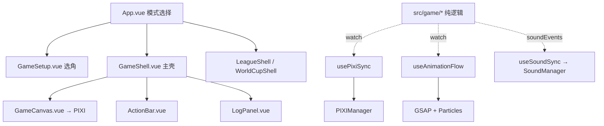

# CLAUDE.md

亡命十三街 — 基于扑克牌的多人对战游戏。Vue 3 驱动 UI，PixiJS v8 渲染牌桌，GSAP 负责动画，Tauri 打包桌面端。
本项目使用中文与用户交流。

**当前形态：Vue 3 + PixiJS + Tauri 版（Godot 4.7 迁移已终止，`godot/` 已移除，git 历史可找回）。**

**线上地址：** `https://menghun-myracler.github.io/13street/`（GitHub Pages 自动部署）

## 快速开始

单 session 工作流。收到任务直接改，改完跑 `npm run test`。

## 常用命令

```bash
npm run dev          # Vite 开发服务器
npm run build        # 生产构建（vite build → postbuild 内联）
npm run preview      # 预览构建产物
npm run test         # 运行 vitest 测试
npm run tauri:dev    # Tauri 桌面开发
```

## 禁用操作

PR以及gh CLI会导致用户GitHub账户封禁，禁止使用。
禁用worktree分支，修改直接作用在main里
禁止自己git push操作，更新完游戏提醒用户手动push
禁止批量拉代码（git clone / git pull），如确实需要先向用户确认

> 以上 git push / gh CLI / git clone / git pull 已写入 `reasonix.toml` 的 `[permissions] deny`，任何模式（含 yolo）都会硬阻断。
> **允许本地 commit**（`git commit` 可执行），仅 push 禁止——任务完成、测试通过后可自行提交。

## 核心设计原则（最重要，每次变更必须遵守）

1. **`src/game/` 是纯逻辑层 — 零依赖。** 不引用 Vue、PIXI、GSAP 或浏览器 API。所有游戏规则在这里（含 league.js / worldCup.js / matchState.js）。
2. **单向数据流：** `gameState` (Vue reactive) → `usePixiSync` (watch) → `PIXIManager` (渲染)。不反向操作。
3. **新机制用通用标记。** 如 `endTurn` 控制回合推进（true=下一玩家，false=当前玩家额外行动），不搞角色特殊路径。
4. **PixiJS 对象用 `shallowRef`，不用 `ref()`。** Vue 深度响应式代理会破坏纹理引用。GSAP 动画用 `sprite.scale.x` 不是 `scaleX`。
5. **伤害计算：先 -2 再 2:1 联盟分配，向下取整（`Math.floor`）。**
6. **角色数据用 `getCharData(player)` 查表。** 不要直接访问 `player.characterName`/`skillName`/`skillDesc` 等——这些字段已移入 CHARACTERS 字典，player 上只保留 `characterId`（数字）。
7. **Player 嵌套字段写完整路径。** 状态效果 → `player.statusEffects.xxx`，关系 → `player.relations.xxx`。
8. **行动顺序按 `CHARACTERS[id].speed` 每回合重排。** speed 降序（大=先动），dead 排末尾，同速按 index 升序。

## 行为准则 — 信息不足时必须追问（最重要）

**绝对禁止在信息不完整时猜测或假设。** 以下情况必须停下来追问用户，不继续执行：

1. **Bug 报告太模糊** — 用户只说「XX 有 bug」但没有给错误日志、复现步骤、预期/实际行为。追问：「请提供控制台报错或 `[game]` 日志，并描述预期行为 vs 实际行为」
2. **功能需求不明确** — 用户说「加一个新角色」但没给技能名称、效果、数值。追问：「新角色的技能是什么？效果数值？是否有使用次数限制？」
3. **多个可能原因时** — bug 有 2 个以上可能的原因时，不要赌一个去改。列出所有假设，追问用户或读日志排除后再改。
4. **第一次听说的问题** — 用户描述的问题不在已修复 Bug 列表或你的认知范围内，先追问细节，不要直接动手。

**好的提问示范：**

> 「你说的『攻击伤害不对』，具体是哪个角色攻击哪个目标？伤害值预期多少、实际多少？控制台 `[game]` 日志里 `damage_calc` 那行输出是什么？」

**善用question** — 不确定的地方不要猜测，question用户获得最准确的方向,不用担心question太多,有疑问无上限问

## 架构


```mermaid
graph TD
    A[App.vue 模式选择] --> B[GameSetup.vue 选角]
    A --> C[GameShell.vue 主壳]
    A --> D[LeagueShell / WorldCupShell]
    C --> E[GameCanvas.vue → PIXI]
    C --> F[ActionBar.vue]
    C --> G[LogPanel.vue]

    H[src/game/* 纯逻辑] -. watch .-> I[usePixiSync]
    H -. watch .-> J[useAnimationFlow]
    I --> K[PIXIManager]
    J --> L[GSAP + Particles]
    H -. soundEvents .-> M[useSoundSync → SoundManager]
```

| 层     | 目录                 | 职责                                                            |
| ------ | -------------------- | --------------------------------------------------------------- |
| 纯逻辑 | `src/game/`        | 状态机 + 角色技能 + AI + 天气 + 联赛/世界杯/比赛（零依赖）      |
| 桥接   | `src/bridge/`      | 监听 gameState → 驱动 PIXI + GSAP + 音效                       |
| 渲染   | `src/pixi/`        | PixiJS v8 Application + 精灵 + 布局 + 粒子                      |
| 控制器 | `src/composables/` | useGameController / useLeagueController / useWorldCupController |
| 爬塔   | `src/solo/`        | 单机模式（logic/ 纯逻辑 + useSoloController + SoloShell）       |
| 模拟宇宙 | `src/simuniverse/` | PVE 无尽深渊（logic/ 纯逻辑 + useUniController + UniShell，DOM 渲染，不依赖 PIXI） |
| 音频   | `src/audio/`       | SoundManager 音效播放（由`src/game/soundEvents.js` 触发）     |
| UI     | `src/components/`  | Vue 3 组件（ActionBar、League*/WorldCup* 系列等）               |

## 游戏模式

| 模式     | 入口                      | 逻辑文件                                     | 说明                                                                                         |
| -------- | ------------------------- | -------------------------------------------- | -------------------------------------------------------------------------------------------- |
| 经典对战 | `App.vue` gameMode      | `src/game/gameState.js`                    | 2-8 人扑克对战，选角色 + 天气                                                                |
| 世界杯   | `App.vue` wcStarted     | `src/game/worldCup.js` + `matchState.js` | 小组赛 A-H → 淘汰赛 R16/QF/SF/Final；常规 90 回合 + 加时 30；点球先得 5 分、每方抽 2 张     |
| 联赛     | `App.vue` leagueStarted | `src/game/league.js`                       | 10 支英超球队，tier 1-3（🏆争冠/⚔️欧战/🛡️保级）；队标`public/team-badges/{teamId}.png` |
| 单机     | `App.vue` gameMode='solo' | `src/solo/logic/solo.js`               | 技能卡肉鸽：章节爬塔/抽3选2/事件检定/商店营地（DOM 渲染） |
| 模拟宇宙 | `App.vue` gameMode='simuniverse' | `src/simuniverse/logic/uniState.js` | PVE 无尽深渊：位面 1-10/11-30/31-60/61+ 循环；扑克牌普攻/防御/开大三选一；敌人模板行动；祝福/奇物/方程；商店/休整/造物调试台；存档 `dead13_uni_save`；设计文档 `docs/simuniverse-design.md` |

比赛状态机 `matchState.js` 在 1v1 游戏之上叠加进球、重置、换人、加时、点球逻辑。

## 游戏状态机

```
PHASE: SETUP → PEACE(前N回合禁攻) → NORMAL(战斗) → GAME_OVER
STEP:  pickAction → attackShowCard → pickTarget → ... → pickAction（循环）
```

`STEP` 驱动 UI（ActionBar 中 `v-if` 判断 `state.step`）。实际 STEP 值：
`pickAction` / `pickTarget` / `attackShowCard` / `gamblePick` / `skillPickTarget` / `skillNahida` / `liniyaPick` / `caiyueangPick` / `allyPick` / `animating`。

## 调试工具

| 工具                    | 用途                                                                                      |
| ----------------------- | ----------------------------------------------------------------------------------------- |
| `npm run test`        | 220 条 vitest 测试（9 文件：damage/alliance/deck/league/TableLayout/solo/uni×3），< 1s |
| 手动跑 test             | 改`src/game/*` 后必须跑 `npm run test`（项目无自动 hook，靠自觉）                     |
| `window.__PIXI_APP__` | 浏览器控制台访问 PIXI Application 内部状态                                                |
| `[game]` 日志         | `console.debug` 输出结构化 JSON，`window.__GAME_LOG_LEVEL__` 动态控制等级             |

## gameState.js 导出函数签名

| 函数                                                 | 参数          | 调用方            |
| ---------------------------------------------------- | ------------- | ----------------- |
| `createGameState()`                                | —            | App.vue           |
| `initGame(state, chars, useWeather?, startRound?)` | —            | useGameController |
| `currentPlayer(state)`                             | state         | 全部              |
| `startAttack(state)`                               | state         | GameShell         |
| `executeAttack(state, targetIdx)`                  | state, number | GameShell         |
| `executeDefense(state)`                            | state         | GameShell         |
| `executeGamble(state)`                             | state         | GameShell         |
| `executeSkill(state)`                              | state         | GameShell         |
| `canUseSkill(state, player)`                       | state, player | UI                |
| `executeHolyWord(state)`                           | state         | GameShell         |
| `canUseHolyWord(state, player)`                    | state, player | UI                |
| `startAlly(state)`                                 | state         | GameShell         |
| `executeAlly(state, targetIdx)`                    | state, number | GameShell         |
| `executeBetray(state)`                             | state         | GameShell         |
| `getAllianceTargets(state)`                        | state         | UI                |
| `serializeGameState(state)`                        | state         | Vue（存档）       |
| `deserializeGameState(state, saveData)`            | state, object | Vue（读档）       |

## PIXI ↔ Vue 桥接

| 接口                                                   | 方向        |
| ------------------------------------------------------ | ----------- |
| `usePixiSync(state, getManager)`                     | Vue → PIXI |
| `useAnimationFlow(state, getManager)`                | Vue → PIXI |
| `PIXIManager.buildScene(players, deckCount)`         | PIXI        |
| `PIXIManager.updatePlayer(index, player, isCurrent)` | PIXI        |
| `GameShell.onRelayout()`                             | Vue → PIXI |

## player 对象渲染字段

PlayerTableSprite `_updateStatus()` 依赖（注意嵌套路径）:
`statusEffects.frozenBy`, `relations.allyIndex`, `relations.allianceTurns`, `relations.betrayalPenalty`,
`statusEffects.stealTarget`, `statusEffects.dotTarget`, `fightingSpirit`, `statusEffects.savepoint`,
`statusEffects.extraAction`, `statusEffects.ignoreTrapThisTurn`, `relations.gamblePenalty`, `relations.consecutiveGambles`

→ 新增状态标签时同步改 `_updateStatus()` 或 `_updateGambleWarn()`。

## 构建关键点

- **`codeSplitting: false`**（vite.config.js）— PixiJS v8 动态 import 在 file:// 协议会失败，必须合并单一 bundle。
- **`resolution` 上限 2x** — `Math.min(dpr, 2)`，移动端 3x 屏 GPU 过载。
- **分发用线上 URL** — 不要依赖 file://（iOS WKWebView 彻底禁止）。
- **Canvas**: 默认 `position: fixed; z-index: 1`；竖屏滚动切为 `position: relative; touch-action: pan-y`。

## 关键文件

| 文件                                | 行数 | 说明                                                |
| ----------------------------------- | ---- | --------------------------------------------------- |
| `src/game/index.js`               | 140  | **桶导出，外部统一入口**                      |
| `src/game/constants.js`           | 213  | CHARACTERS 字典（11 角色）+ getCharData + 阶段/天气 |
| `src/game/gameState.js`           | 541  | 状态创建 + 初始化 + 回合推进 + 统一导出             |
| `src/game/player.js`              | 59   | Player 工厂函数                                     |
| `src/game/serialize.js`           | 193  | 游戏存档/读档                                       |
| `src/game/combat.js`              | 602  | 攻击/防御                                           |
| `src/game/gamble.js`              | 131  | 赌命（抽牌+设陷阱）                                 |
| `src/game/skills.js`              | 411  | 11 个角色技能（路由 + 各角色实现）                  |
| `src/game/damage.js`              | 205  | 伤害结算 + 死亡 + 游戏结束判定                      |
| `src/game/alliance.js`            | 166  | 结盟/背刺/目标筛选                                  |
| `src/game/artifacts.js`           | 207  | 圣遗物系统（圣言自明+伤害加成+击破计数）            |
| `src/game/caiyueang.js`           | 175  | 菜月昴死亡回归（存档/读档/深拷贝）                  |
| `src/game/league.js`              | 415  | 联赛模式（10 支球队 + 赛程）                        |
| `src/game/worldCup.js`            | 266  | 世界杯锦标赛状态机（小组赛→淘汰赛）                |
| `src/game/matchState.js`          | 467  | 1v1 比赛状态机（进球/重置/换人/加时/点球）          |
| `src/game/ai/index.js`            | 171  | AI 公共 API + 共享工具                              |
| `src/game/ai/skilled.js`          | 305  | AI 熟练难度                                         |
| `src/game/ai/hell.js`             | 305  | AI 地狱难度（偷看牌库）                             |
| `src/game/ai/easy.js`             | 53   | AI 简单难度                                         |
| `src/game/weather.js`             | 44   | 天气牌堆 + getter                                   |
| `src/game/deck.js`                | 59   | 扑克牌创建/洗牌/抽牌/墓地重构                       |
| `src/game/gameLogger.js`          | 371  | 开发日志（零依赖，`[game]` JSON 到 console）      |
| `src/audio/SoundManager.js`       | 120  | 音效播放                                            |
| `src/pixi/core/PIXIManager.js`    | 271  | Application 管理 + 场景树 + 粒子                    |
| `src/pixi/layout/TableLayout.js`  | 203  | 自适应布局（横屏单/双行，竖屏2列）                  |
| `src/bridge/useAnimationFlow.js`  | 410  | GSAP 动画触发 + 粒子调度                            |
| `src/solo/logic/solo.js`          | —   | 单机模式状态机（地图/成长/卡组/金币/存档）          |
| `src/solo/logic/soloCombat.js`    | —   | 单机战斗（抽3选2/牌堆坟场/护盾/斗志/AI）            |
| `src/solo/logic/soloConstants.js` | —   | 技能卡池 13 张 / 敌人 / 节点链 / 数值常量           |
| `src/solo/SoloShell.vue`          | —   | 单机 UI 主壳（地图/战斗/商店/事件/营地/结算）       |
| `src/simuniverse/logic/uniState.js` | — | 模拟宇宙状态机（位面/层推进/区域生成/货币/存档/菜月昴读档） |
| `src/simuniverse/logic/uniCombat.js` | — | 模拟宇宙战斗（扑克牌三选一/敌人模板/波次/转化及格线/首领穿插） |
| `src/simuniverse/logic/uniSkills.js` | — | 11 角色 PVE 技能（等级 1-10 查表/冷却）             |
| `src/simuniverse/logic/uniEvents.js` | — | 分支事件/奖励/冒险（9+8+3 个）                      |
| `src/simuniverse/logic/uniBuffs.js` | —  | 祝福 59 / 奇物 79 / 方程 13 全量数据+效果 + modifier 聚合 |
| `src/simuniverse/logic/uniShop.js` | —   | 商店/休整/造物调试台（热量强化/覆写）               |
| `src/simuniverse/UniShell.vue`    | —   | 模拟宇宙 UI 主壳（2选1/战斗/事件/商店/工作台）      |

## 已修复的关键 Bug（禁止重复犯错）

- `new Sprite()` 空纹理设 width/height → NaN scale 崩溃
- `CardSprite._renderEmpty()` 首次调用时 `_dashText` 为 null
- 冰封效果 `nextPlayer` 无深度保护 → 无限递归
- 花色 `SUITS` 为空字符串（必须保持 `♠♥♦♣`）
- `buildScene()` 传 TableLayout 尺寸**不能除以 resolution**
- 竖屏 canvas 用 `position: absolute` → 不占文档流无法滚动
- `_fenjinHeal = null` 永不清除 → 后续所有角色技能触发都被路由到风堇。**必须用 `= undefined` 或 `delete` 清除标记**
- `reset1v1Game` 硬编码 `useWeather: false` → 世界杯击杀后天气消失。**重置比赛前必须保存天气状态**

## 开发日志系统

所有游戏逻辑操作自动记录结构化日志到 `console.debug`，格式为 `[game] {"ts":...,"type":"...",...}`。

### 控制台使用

```js
window.__GAME_LOG_LEVEL__ = 0; // DEBUG，所有日志
window.__GAME_LOG_LEVEL__ = 1; // INFO
window.__GAME_LOG_LEVEL__ = 2; // WARN，只看异常

// Chrome/Edge: 在 Console 的 Filter 框输入 [game]
```

### 关键事件类型（`src/game/gameLogger.js` → `CAT`）

| type                                                    | 说明                      | 关键字段                                      |
| ------------------------------------------------------- | ------------------------- | --------------------------------------------- |
| `turn_start` / `turn_end`                           | 回合推进                  | round, playerIndex, playerName                |
| `attack_start` / `attack_draw` / `attack_execute` | 攻击流程                  | attackerIndex, targetIndex, cards, totalValue |
| `damage_calc`                                         | 伤害计算                  | rawValue, afterMinus2, allianceSplit          |
| `hp_change`                                           | **HP 变化（统一）** | playerIndex, from, to, delta, reason          |
| `defense_start` / `defense_draw`                    | 防御流程                  | playerIndex, cards                            |
| `gamble_start` / `gamble_result`                    | 赌命                      | drawnCards, trapIdx, baitIdx                  |
| `trap_trigger`                                        | 陷阱触发                  | victimIndex, trapCard, trapValue              |
| `skill_use` / `skill_effect`                        | 技能                      | characterId, targetIndex, effect              |
| `ally_form` / `betrayal`                            | 联盟/背刺                 | playerA, playerB, turns                       |
| `weather_change` / `weather_effect`                 | 天气                      | from, to, effect                              |
| `solo_node`                                           | 单机节点                  | nodeType, enemyKey, playerHp                  |
| `solo_poker_draw` / `solo_poker_pick`               | 单机抽3选2                | actionPoints, drawCount, spirit               |
| `solo_skill_draw` / `solo_card_play`                | 单机抽牌/出牌             | cardId, count, cost, actionPointsLeft         |
| `solo_damage` / `solo_shield` / `solo_spirit`     | 单机伤害/护盾/斗志        | dmg, shieldDmg, hpDmg, spiritGain             |
| `solo_enemy_turn`                                     | 单机敌方回合              | actionPoints, hand, enemyHp, enemyShield      |
| `solo_event`                                          | 单机事件检定              | eventId, check, outcome, gold, playerHp       |
| `solo_end` / `solo_reward`                          | 单机胜负/奖励             | result, gold, exp, rarity, attrPoint          |
| `anomaly`                                             | **异常检测**        | 伤害偏差、HP 负值、高值卡低伤害等             |

### 排查 bug 示例

```
▎ 浏览器控制台打开游戏，选4人，过3回合，读所有 [game] 日志（Console Filter 输入 [game]），
▎ 筛选 type:'damage_calc' 检查联盟伤害分配是否正确
▎ 筛选 type:'hp_change' 对比 from/to 找出异常扣血
```

## Notes

- 拟定方案后先由用户审批
- 尽可能避免硬编码
